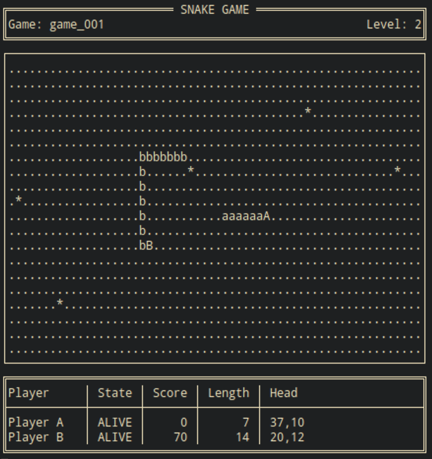

# funkysnakes

**The reference implementation for the pragmatic system-design ideas developed on [funkyposts.dev](https://funkyposts.dev).**

This project shows how *reducing interaction complexity* makes a C++ system easier to reason about, test, and evolve. It demonstrates these ideas in a small but complete two-player Snake game, using functional techniques — explicit state, isolated side effects, and actor-based boundaries — as practical tools rather than goals.

The central idea, from the blog: **software complexity is largely driven by the interactions between components** — not the components themselves. Tight coupling, hard-to-test logic, and rigid architectures come from the number and nature of those interactions. This repository demonstrates how to reduce and clarify them, applied pragmatically in modern C++.

The blog explains *why* these techniques work; this repository shows *how* they fit together in one working application. It is meant to be read alongside the articles, not just played: it prioritizes clarity of design over minimizing files or abstractions.

**[Build and run](#build-and-run)** · **[Explore the architecture](#architecture)** · **[Read the series](#reading-order)**



## Who is this for?

Experienced C++ developers working in object-oriented codebases who are running into:

- difficult testing
- increasing coupling
- growing architectural rigidity
- concurrency complexity

…and want practical, incremental improvements without rewriting everything. The emphasis is on bridges from familiar OOP habits to better system design, not a paradigm switch.

## Why this design?

As software systems grow, interactions between state, I/O, concurrency, and business logic become increasingly difficult to understand and change. This project demonstrates practical ways to reduce those interactions while remaining idiomatic modern C++. The outcomes:

- game rules become **independent from rendering and input** — the core interacts with nothing external
- every **state transition becomes visible** at the call site instead of hidden inside objects
- **domain invariants have one owner** — fewer places can influence a given rule
- **effects become explicit** — the interaction between logic and the outside world is data, not a hidden call
- **concurrency boundaries become explicit** — direct access to shared mutable state is replaced by message passing
- the **core becomes testable in isolation** — no rendering, input, or timers required

## Reading order

The accompanying series develops these ideas in the order it was published:

1. [Bridging Object-Oriented and Functional Thinking in Modern C++](https://funkyposts.dev/posts/bridging-object-oriented-and-functional-thinking-in-modern-cpp)
2. [Handling Side Effects in Modern C++: Interfacing Pure Functions with Our Imperative World](https://funkyposts.dev/posts/handling-side-effects-in-modern-cpp-designing-systems-around-pure-functions)
3. [When One Shell Isn't Enough: Scaling the Pattern with Actors in C++](https://funkyposts.dev/posts/when-one-shell-isnt-enough-scaling-the-functional-core-imperative-shell-pattern-with-actors-in-cpp)
4. [Mastering State in Modern C++: Making It Explicit](https://funkyposts.dev/posts/mastering-state-in-modern-cpp-making-it-explicit)
5. [Mastering State in Modern C++: Making It Encapsulated](https://funkyposts.dev/posts/mastering-state-in-modern-cpp-making-it-encapsulated)
6. [Mastering State in Modern C++: Making It Protected](https://funkyposts.dev/posts/mastering-state-in-modern-cpp-making-it-protected)
7. [Effects in Modern C++: Making Them Explicit](https://funkyposts.dev/posts/effects-in-modern-cpp-making-them-explicit)

The [Problem → technique → code](#problem--technique--code) table below links each interaction problem to the technique that addresses it, the post that develops it, and the code that implements it.

## Architecture

The **functional core–imperative shell** pattern is the backbone here — but as *one* technique for reducing interaction complexity, not an end in itself. Each part below is presented through the same lens: how does it reduce or clarify the interactions between logic, state, effects, and concurrency?

### Functional core

Pure functions eliminate unnecessary interactions with external state: the core depends only on its inputs. Advancing the game one tick is a value-in, value-out transformation — no I/O, no shared state. A tick composes small functions, each focused on one part of the state:

```cpp
auto tick_pipeline = makePipe(
    over_direction_command_filter_state(direction_command_filter::try_consume_next),
    over_snakes(applyDirectionMsgs),
    over_snakes_viewing_board_and_food(moveSnakes),
    over_snakes_and_scores(handleCollisions),
    when<0>(isBiteDropFoodMode, over_food(dropCutTailsAsFood)),
    when(isBiteDropFoodMode, over_food_viewing_snakes(dropDeadSnakesAsFood)),
    over_food_and_scores_viewing_snakes(handleFoodEating),
    over_food_viewing_board_and_snakes(bindFront(replenishFood, makeRandomIntGenerator(), MIN_FOOD_COUNT)),
    when(shouldRepositionFood,
         over_food_viewing_board_and_snakes(bindFront(repositionRandomFood, makeRandomIntGenerator()))),
    clearRepositionFlag);

state = tick_pipeline(state);  // pure: next state computed from the current state
```

Each `over_*` adapter is a lens that focuses one operation on part of `GameState`; `when(...)` runs a stage conditionally. The whole tick stays a single pure function from state to state.

> **Why is game logic written this way?**
> [Bridging Object-Oriented and Functional Thinking](https://funkyposts.dev/posts/bridging-object-oriented-and-functional-thinking-in-modern-cpp) ·
> [Handling Side Effects](https://funkyposts.dev/posts/handling-side-effects-in-modern-cpp-designing-systems-around-pure-functions)

### Explicit and protected state

State is passed to pure functions and returned as new state, so every transition is visible at the call site. Where state carries invariants, a protected module reduces the number of places that can influence it to exactly one:

- [`snake_model.hpp`](include/snake/snake_model.hpp) keeps a snake body a connected chain and stops dead snakes from moving.
- [`direction_command_filter.hpp`](include/snake/direction_command_filter.hpp) owns buffered inputs behind an opaque queue.

> **Why keep state explicit instead of hiding it in objects?**
> The *Mastering State* trilogy —
> [Explicit](https://funkyposts.dev/posts/mastering-state-in-modern-cpp-making-it-explicit) ·
> [Encapsulated](https://funkyposts.dev/posts/mastering-state-in-modern-cpp-making-it-encapsulated) ·
> [Protected](https://funkyposts.dev/posts/mastering-state-in-modern-cpp-making-it-protected) —
> and [`architecture_concepts.md`](architecture_concepts.md) for the opaque-state module pattern.

### Explicit effects

Pure functions don't perform effects; they return them as data for the shell to interpret. The return type spells out both the next state and every effect that should follow it:

```cpp
// Pure core: returns next state plus the effects that should follow
std::tuple<GameState, RenderableStateMsg, std::optional<PlayerAliveStatesMsg>>
handleTick(GameState state, const GameTimerElapsedEvent& event);

// Shell: drains events, calls the core, dispatches the returned effects
processEventWithState(game_loop_timer_, game_state_, handleTick, effect_handler);
```

`processEventWithState` (via `with_effect_handling`) splits the returned tuple — element 0 becomes the new state, the rest are dispatched to the effect handler. Returning effects as data makes the interaction between the functional core and the shell explicit rather than implicit, and every observable effect shows up in the return type instead of being hidden in the body, so the core stays testable.

> **Why represent effects as values?**
> [Effects in Modern C++: Making Them Explicit](https://funkyposts.dev/posts/effects-in-modern-cpp-making-them-explicit)

### Imperative shell: the actor system

All side effects — input, rendering, timing, message passing — live in actors. Each runs on its own Asio strand, isolating actor state and avoiding manual locking:

| Actor | Responsibility |
|-------|----------------|
| `GameEngineActor` | drives the functional core and dispatches its declared effects |
| `GameManagerActor` | game lifecycle and timers |
| `RendererActor` | draws game state to the console |
| `InputActor` | reads the keyboard |

Actors reduce interaction complexity by replacing direct shared-state coordination with explicit message boundaries: instead of one shell handling every effect, the system is partitioned into isolated core–shell pairs that evolve independently.

> **Why actors instead of mutexes and shared state?**
> [When One Shell Isn't Enough: Scaling the Pattern with Actors in C++](https://funkyposts.dev/posts/when-one-shell-isnt-enough-scaling-the-functional-core-imperative-shell-pattern-with-actors-in-cpp)

## Project structure

The files below sit flat under `include/snake/` and `src/`. Grouping them by architectural responsibility is a *logical view* of the code, not the on-disk layout:

```
Functional core        (pure logic — no I/O, no shared state)
  game_logic.*             rules, movement, collisions, scoring, food
  game_state_lenses.hpp    focus transformations on parts of GameState
  game_state_views.hpp     read-only extractors over GameState
  generic_lens.hpp         reusable lens machinery
  snake_model.*            protected state module: snake bodies
  direction_command_filter.*  encapsulated state module: buffered inputs
  state_with_effect.hpp    core → shell effect descriptions
  process_helpers.hpp      effect-handling decorators

Imperative shell       (side effects — the only place I/O happens)
  renderer_actor.*         console rendering
  input_actor.*            keyboard input
  stdin_reader.*           raw terminal reading

Coordination           (lifecycle, timing, messaging)
  game_engine_actor.*      drives the core each tick
  game_manager_actor.*     game lifecycle and timers
  game_messages.hpp        message + GameState definitions
  control_messages.hpp     join / leave / start / summary
```

## Problem → technique → code

Each interaction problem, the design technique that reduces it, the post that develops it, and the code that implements it:

| Problem | Technique (post) | Implementation |
|---------|------------------|----------------|
| Hidden dependencies on external state | Pure functions — [Handling Side Effects](https://funkyposts.dev/posts/handling-side-effects-in-modern-cpp-designing-systems-around-pure-functions) | [`game_logic.hpp`](include/snake/game_logic.hpp) / [`game_logic.cpp`](src/game_logic.cpp) |
| State changes scattered and implicit | Explicit state — [Mastering State: Making It Explicit](https://funkyposts.dev/posts/mastering-state-in-modern-cpp-making-it-explicit) | `GameState` in [`game_messages.hpp`](include/snake/game_messages.hpp) |
| Updates to nested state tangle callers | Lenses & views — [Mastering State: Making It Explicit](https://funkyposts.dev/posts/mastering-state-in-modern-cpp-making-it-explicit) | [`game_state_lenses.hpp`](include/snake/game_state_lenses.hpp), [`game_state_views.hpp`](include/snake/game_state_views.hpp), [`generic_lens.hpp`](include/snake/generic_lens.hpp) |
| Implementation details leak across modules | Encapsulated state module — [Mastering State: Making It Encapsulated](https://funkyposts.dev/posts/mastering-state-in-modern-cpp-making-it-encapsulated) | [`direction_command_filter.hpp`](include/snake/direction_command_filter.hpp) |
| Invariants influenced from many places | Protected state module — [Mastering State: Making It Protected](https://funkyposts.dev/posts/mastering-state-in-modern-cpp-making-it-protected) | [`snake_model.hpp`](include/snake/snake_model.hpp) |
| Effects hidden inside function bodies | Effects as data — [Effects: Making Them Explicit](https://funkyposts.dev/posts/effects-in-modern-cpp-making-them-explicit) | [`state_with_effect.hpp`](include/snake/state_with_effect.hpp) |
| Effect handling tangled with logic | Effect interpreter — [Effects: Making Them Explicit](https://funkyposts.dev/posts/effects-in-modern-cpp-making-them-explicit) | [`process_helpers.hpp`](include/snake/process_helpers.hpp) |
| Shared mutable coordination across threads | Actors / message boundaries — [When One Shell Isn't Enough](https://funkyposts.dev/posts/when-one-shell-isnt-enough-scaling-the-functional-core-imperative-shell-pattern-with-actors-in-cpp) | `GameEngineActor` in [`game_engine_actor.hpp`](include/snake/game_engine_actor.hpp) |

Built on two supporting libraries: [funkyactors](https://github.com/mahush/funkyactors) (the actor framework) and [funkypipes](https://github.com/mahush/funkypipes) (the function-pipeline library behind `makePipe`).

## Game features

- **Two-player local multiplayer** (Player A: WASD, Player B: arrow keys)
- **Progressive difficulty**: the game speeds up with each level
- **Collision detection**: snakes can bite each other's tails
- **Score system**: points for eating food, penalties for collisions
- **Food mechanics**: random spawning and periodic repositioning
- **Clean terminal UI**: box-drawing characters with real-time updates

## Build and run

```bash
# Build
cmake -S . -B build
cmake --build build

# Run the game
./build/snake_actors

# Run tests
./build/test_snake
```

## Dependencies

- **CMake 3.12+**
- **C++17 compiler** (GCC 11+, Clang 14+)
- **funkyactors** — actor framework, auto-downloaded via FetchContent from [github.com/mahush/funkyactors](https://github.com/mahush/funkyactors)
- **funkypipes** — function-pipeline library, auto-downloaded via FetchContent from [github.com/mahush/funkypipes](https://github.com/mahush/funkypipes)
- **Standalone Asio 1.30.2** (bundled with funkyactors)
- **GoogleTest 1.15.2** (optional, for tests, auto-downloaded)

## Development

This project was developed with the assistance of AI tools for code generation, refactoring, and documentation.

## License

See the [LICENSE](LICENSE) file.
